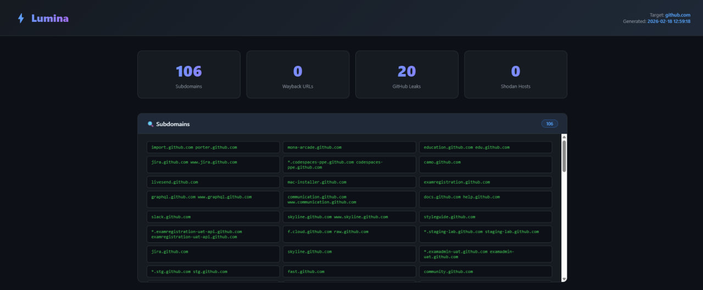

# ⚡ Lumina — Passive Reconnaissance Tool


> A fully passive OSINT reconnaissance tool for domains — zero requests to the target server.

Lumina collects data exclusively from third-party public sources, making it completely safe and undetectable for security researchers, penetration testers, and bug bounty hunters.

---

## 🔍 Features

| Module                | Source                            | API Key |
| --------------------- | --------------------------------- | ------- |
| Subdomain Enumeration | crt.sh Certificate Transparency   | ❌ Free |
| Wayback Machine URLs  | web.archive.org                   | ❌ Free |
| GitHub Leaks          | GitHub Search API                 | ✅ Free |
| Shodan Hosts & Ports  | Shodan API                        | ✅ Free |
| Email Harvesting      | Hunter.io API                     | ✅ Free |
| DNS Records           | Google DNS (A, MX, NS, TXT, AAAA) | ❌ Free |
| Tech Stack Detection  | HTTP headers & HTML analysis      | ❌ Free |
| HTML Report           | Beautiful dark-theme report       | ❌ —    |

---

## 📸 Preview

## 

## 🚀 Installation

```bash
git clone https://github.com/surfruit/lumina
cd lumina
pip install -r requirements.txt
cp .env.example .env
```

Edit `.env` and add your API keys:

```env
GITHUB_TOKEN=your_github_token
SHODAN_API_KEY=your_shodan_api_key
HUNTER_API_KEY=your_hunter_api_key
```

---

## ⚙️ Usage

```bash
# Basic scan
python main.py -d example.com

# Custom output file
python main.py -d example.com -o results.html

# Skip GitHub search
python main.py -d example.com --skip-github

# Skip Shodan search
python main.py -d example.com --skip-shodan
```

---

## 🔑 API Keys

All API keys are **free**:

| Service   | Purpose               | Link                                                             |
| --------- | --------------------- | ---------------------------------------------------------------- |
| GitHub    | Leaked secrets search | [github.com/settings/tokens](https://github.com/settings/tokens) |
| Shodan    | Open ports & hosts    | [account.shodan.io](https://account.shodan.io)                   |
| Hunter.io | Email harvesting      | [hunter.io/api-keys](https://hunter.io/api-keys)                 |

---

## 📁 Project Structure

```
lumina/
├── main.py                 # CLI entry point
├── modules/
│   ├── subdomains.py       # crt.sh subdomain enumeration
│   ├── wayback.py          # Wayback Machine URLs
│   ├── github_leaks.py     # GitHub leaked secrets search
│   ├── shodan.py           # Shodan hosts & ports
│   ├── emails.py           # Hunter.io email harvesting
│   ├── dns_lookup.py       # DNS records (A, MX, NS, TXT, AAAA)
│   └── tech_detect.py      # Technology stack detection
├── report/
│   ├── generator.py        # Jinja2 report generator
│   └── template.html       # Dark-theme HTML template
├── .env.example
├── requirements.txt
└── README.md
```

---

## 🛠️ Adding a New Module

See [CONTRIBUTING.md](CONTRIBUTING.md) for full guide. Quick example:

```python
import httpx

async def your_module(domain: str):
    results = []
    try:
        async with httpx.AsyncClient(timeout=15) as client:
            # your logic here
            pass
    except Exception as e:
        print(f"[-] Error: {e}")
    return results
```

---

## 🗺️ Roadmap

### v1.1

- [ ] VirusTotal integration — malware & reputation check
- [ ] WHOIS lookup — registrar, creation date, owner info
- [ ] Pastebin & GitHub Gist monitoring
- [ ] JSON export alongside HTML report

### v1.2

- [ ] SecurityTrails API support
- [ ] Slack / Telegram notifications when scan completes
- [ ] Multiple domains scan at once
- [ ] Docker support — `docker run lumina -d example.com`

### v2.0

- [ ] Web UI — browser-based interface
- [ ] Scan history & comparison
- [ ] Scheduled automatic scans
- [ ] CVE lookup for detected technologies

> 💡 Have an idea? Open an [issue](https://github.com/surfruit/lumina/issues) or contribute via [pull request](https://github.com/surfruit/lumina/pulls)!

---

## ⚠️ Disclaimer

This tool is intended for **legal use only** — authorized security testing, bug bounty programs, and OSINT research. The author is not responsible for any misuse. Always ensure you have permission before scanning any domain.

---

## 📄 License

[MIT License](LICENSE) — free to use and modify.

---

<p align="center">Made with ❤️ for the OSINT & security community</p>
